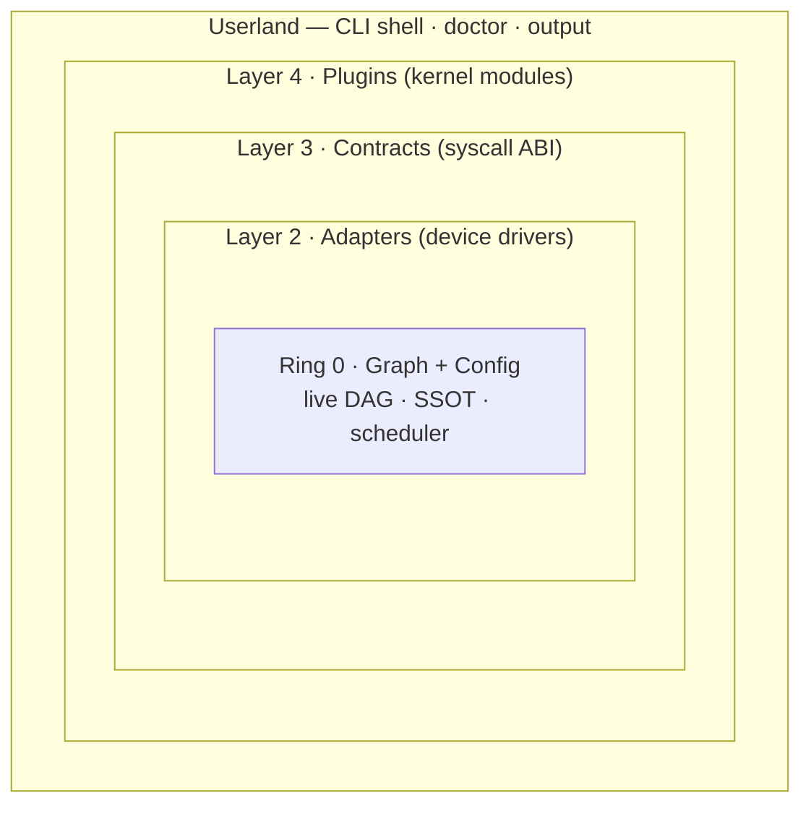

# Acthur as an Operating System — Design Sketch

**Status:** Living design note · **Companion to:** [`acthur-prd.md`](./acthur-prd.md)
**Scope:** the complete OS architecture, what is built today, and the path to finish it.
**Diagrams:** editable Excalidraw sources in [`docs/diagrams/`](./diagrams/) (open at
[excalidraw.com](https://excalidraw.com) — they import directly).

---

## 1. Context & purpose

The PRD calls Acthur a *"runtime graph operating system with pluggable infrastructure
nodes"* and draws an explicit kernel analogy (PRD §3.6). That framing is not marketing
gloss — the code is genuinely structured like a small operating system: a single Go
binary that owns a process table, a scheduler, a syscall ABI, a driver model, loadable
modules, and an init system.

This document does three things the PRD does not:

1. **Names the OS subsystems explicitly** and maps each to a concrete Go package.
2. **Grades each subsystem against the actual code** (✅ done / 🟡 partial / ❌ missing),
   with file references so the grading is auditable.
3. **Sequences the remaining work** as a subsystem-driven roadmap aligned to PRD §21.

It is the architectural north-star plus an honest status map. Where the PRD describes
the destination, this describes the machine and how far it has been built.

---

## 2. The OS thesis

An operating system is the layer that turns raw hardware into a stable, multiplexed
platform for programs. Acthur does the analogous thing for a *multi-service
application*: it turns a pile of frameworks, databases, and processes into one
coherent, supervised, contract-checked system driven from a single source of truth.

The analogy is structural, not decorative:

| OS kernel concept            | Acthur equivalent                                    |
|------------------------------|------------------------------------------------------|
| Boot loader + kernel config  | `acthur.yml` → typed `Config`                        |
| Process table + scheduler    | the live graph (DAG) + topological ordering          |
| System calls (the ABI)       | contracts on `data_flow` edges                       |
| Device drivers               | adapters (`runtime:framework`)                       |
| Loadable kernel modules      | plugins, loaded via `KernelAPI` + an event bus       |
| Init system (PID 1)          | `acthur dev` — the dev orchestrator                  |
| Process management/reaping   | the process manager + supervisor (backoff)           |
| IPC / message bus            | the event bus (+ a future event mesh) and the proxy  |
| Networking stack             | the reverse proxy + service discovery + `.test` DNS  |
| Interrupts / hotplug         | the file watcher → reload cascade                    |
| Watchdog                     | the health checker                                   |
| Userland diagnostics / shell | `doctor`, the CLI, the output formatter              |
| Compiler + linker            | the generator engine + `system.json` AST             |
| Package manager              | the adapter/plugin registries + `acthur add`         |
| Image export / `mkinitramfs` | deploy = projecting the graph onto a target          |

### The Four-Layer Model as protection rings

The PRD's Four-Layer Model is, in OS terms, a **ring/privilege model** with a strict
"no reaching upward" rule. Ring 0 (the graph) is the only thing that may command the
layers around it; outer layers may only request, never command inward.

> **Diagram:** [`diagrams/acthur-kernel-rings.excalidraw`](./diagrams/acthur-kernel-rings.excalidraw)



**Communication law (enforced by package boundaries):** Graph → *calls* → Adapters;
Graph → *fires hooks* → Plugins; Plugins → *mutate* → Graph; Contracts → *enforce* →
edges. Forbidden: Plugins ✗ Adapters, Adapters ✗ Plugins, and Contracts never execute
(they are passive law).

---

## 3. System overview

```mermaid
flowchart LR
    yml["acthur.yml"] --> cfg["config<br/>(boot loader)"]
    cfg --> graph["graph<br/>(scheduler / process table)"]
    graph --> engine["engine<br/>(init / PID 1)"]
    engine --> proc["process<br/>(supervisor)"]
    engine --> proxy["proxy<br/>(net stack)"]
    engine --> health["health<br/>(watchdog)"]
    engine --> watcher["watcher<br/>(interrupts)"]
    graph --> adapter["adapter<br/>(drivers)"]
    plugin["plugin<br/>(modules + event bus)"] --> graph
    contract["contract<br/>(syscall ABI)"] -.enforce.-> graph
    adapter --> gen["generator<br/>(compiler — MISSING)"]
    gen --> code["framework-native code"]
    cli["cmd / output<br/>(shell + TTY)"] --> engine
    doctor["doctor<br/>(diagnostics)"] --> engine
```

The rest of the document walks each subsystem from Ring 0 outward.

---

## 4. Ring 0 — the kernel core (`graph` + `config`)

**Role:** the process table, the scheduler, and the boot loader. Everything else is a
projection of this.

### `config` — boot loader (✅ done)
`internal/config/config.go` parses `acthur.yml` into a typed `Config`, discovers it by
walking up the directory tree (`Find`, git-style), applies defaults (`applyDefaults`),
and validates structure (`Validate`). Validation already enforces real invariants:
`data_flow` edges must carry contracts, `emits`/`subscribes_to` must carry events, no
self-edges, edges must reference existing nodes. Pool config carries the
cross-tenant-safety knobs (`before_acquire`, `after_release`).

### `graph` — scheduler & process table (✅ done)
`internal/graph/graph.go` builds a live DAG (`Build`) with in/out adjacency lists and:
- **Scheduling:** `StartupOrder` / `ShutdownOrder` via Kahn topological sort
  (`topoSort`), infra before services; **`detectCycle`** (DFS three-color) rejects bad
  graphs at build time.
- **Policy-as-traversal:** `DependenciesOf`, `DependentsOf`, `PropagateFrom`
  (reload cascade), `AffectedByFailure` (blast radius), `ProxiedNodes`, `ContractFor`.
- **State machine:** thread-safe `Node` state (`Pending→Starting→Healthy→…→Failed`)
  with subscriber notifications — the live process table.
- **Validation:** orphan detection, missing contracts, `applies_to` must target
  services.

**Why it matters:** in Acthur, *runtime decisions are graph traversals*. Startup order,
shutdown order, hot-reload fan-out, and failure blast-radius are all the same DAG
queried different ways — exactly how a scheduler reads a process table.

---

## 5. The syscall ABI — contract engine (`contract`)

**Role:** the stable interface between any two nodes. A `data_flow` edge without a
contract is a syscall with no signature — rejected.

`internal/contract/contract.go` provides:
- **Parsing:** `ParseFile` for native `.contract.yml` (+ checksum). 🟡 `.proto` and
  `.graphql` parsers are **stubs** (return name/transport only).
- **Registry:** `name@version` keyed, idempotent, multi-version aware.
- **ABI-compat checking — the diff engine (✅):** `Diff` classifies changes as breaking
  vs non-breaking (removed endpoint, method/path change, auth added, required input
  added, output field removed, transport change → breaking; new optional field/endpoint
  → non-breaking). This is the kernel's "ABI stability" guarantee and the core of the
  pre-deploy gate.
- **Runtime enforcement:** `Validator.ValidateRequest` checks auth presence and
  required inputs. Transports enumerated: http / grpc / ws / queue / **graphql**.

**Gaps:** proto/GraphQL importers; enforcement is not yet wired into the proxy
(§9).

---

## 6. Driver model — adapters (`adapter`)

**Role:** device drivers. Each adapter knows exactly one framework and nothing about
plugins or other adapters. The kernel calls drivers; drivers never call back.

`internal/adapter/adapter.go` defines the **8-method driver contract** (`Name`,
`Category`, `Detect`, `Scaffold`, `DevCommand`, `BuildCommand`, `TestCommand`,
`GeneratorTargets`, `Dockerfile`, `EnvVars`) and a registry (`Register`/`Resolve`/
`ByCategory`). `Detect` is the equivalent of device probing.

**Reference driver (✅):** `internal/adapter/backend/gofiber/gofiber.go` is a complete
`go:fiber` driver — `Detect` reads `go.mod`, `Scaffold` emits 12 working files, dev/
build/test commands (`air`, `go build`, `go test`), a hardened multi-stage distroless
Dockerfile, and **16 generator targets**.

**Gap (bus factor):** only one driver exists. The whole matrix (`go:chi`, `rust:axum`,
`node:fastify`, `ui:astro`, `ui:next`, `db:postgres`, `cache:redis`, …) is unbuilt — the
infra/db images are currently handled inline by the dev engine (§8), not by drivers.

---

## 7. Kernel modules — plugins (`plugin`)

**Role:** loadable capabilities. The `KernelAPI` is the stable module ABI; the event
bus is the interrupt vector table modules subscribe to.

`internal/plugin/plugin.go` provides:
- **Module ABI:** `Plugin` (3 methods: `Name`/`Version`/`DependsOn`/`Register`) and a
  restricted `KernelAPI` (9 methods: `OnEvent`, `RegisterCommand`,
  `RegisterGenerator`, `RegisterSchema`, `RegisterMiddleware`, `AddNode`, `AddEdge`,
  read-only `Graph`, `Log`). Modules touch the kernel **only** through this surface.
- **Event bus (✅):** `Bus.On`/`Emit`, synchronous, **panic-recovering** (a faulty
  module can't crash the kernel), with **19 lifecycle events** (graph build, node
  start/healthy/stop/failure, proxy req, db migrate/seed, deploy, contract
  registered/violated, plugin loaded/error).
- **Dependency-ordered loading (✅):** `Load` resolves topological order
  (`resolveOrder`, Kahn + cycle detection) and emits `plugin:loaded` / `plugin:error`.

**Gap:** the machinery is real but **zero concrete modules exist**. `auth`,
`migrations`, `rbac`, `multitenancy` are interfaces in the PRD, not code — and they need
the generator (§11) to emit anything.

---

## 8. Init & process subsystem (`engine` + `process`)

**Role:** PID 1 and process reaping. `acthur dev` is the init system that brings the
whole graph up in order and supervises it.

> **Diagram:** [`diagrams/acthur-boot-sequence.excalidraw`](./diagrams/acthur-boot-sequence.excalidraw)

**Boot sequence (`internal/engine/dev.go`, ✅ core):**
1. load `acthur.yml` → build graph 2. doctor 3. resolve topo order
4. start infra via Docker (image map for postgres/mysql/minio/redis/nats) → TCP health
5. *load plugins* (🟡 hook point, no modules) 6. spawn services via the adapter's
`DevCommand` → HTTP `/health` 7. *set up `.test` DNS* (❌ planned) 8. start dev proxy
9. *start watcher* (🟡 built but not wired) 10. ready → print URLs. SIGINT/SIGTERM →
reverse-order graceful shutdown.

**Service discovery (✅):** `buildEnv` injects `<NODE>_URL` env vars derived from
`depends_on` / `data_flow` edges — no service mesh, no manual wiring.

**Supervisor (`internal/process/process.go`, ✅):** `Process`/`Supervisor`/`Manager`,
SIGTERM→SIGKILL escalation, **exponential backoff with stability reset**
(`DefaultPolicy`: 10 restarts, 500ms→30s, 5min reset), reverse-order `StopAll`.

**Gaps:** watcher↔engine wiring; `.test` DNS strategies; docker-context service
discovery (currently localhost-oriented).

---

## 9. Networking & IPC (`proxy` + event bus)

**Role:** the network stack and inter-process communication fabric.

> **Diagram:** [`diagrams/acthur-ipc-dataflow.excalidraw`](./diagrams/acthur-ipc-dataflow.excalidraw)

**Reverse proxy (`internal/proxy/proxy.go`, 🟡):** builds routes from `ProxiedNodes`
(graph-derived), matches **longest-prefix-wins**, injects `X-Forwarded-*` and
`X-Acthur-Node`, returns 502 on dead backend, supports `UpdateRoutes` (hot route
reload). **Gaps:** WebSocket upgrade is detected but not passed through; **contracts are
not enforced at the proxy** (the diff engine exists in §5 but isn't called on the wire).

**IPC fabric:**
- *Synchronous:* client → proxy → services; service-to-service via injected `*_URL`.
- *Asynchronous:* `emits` / `subscribes_to` edges over a queue; the in-process event
  bus (§7) is the single-node form, with a distributed **event mesh** as the multi-node
  evolution (PRD §46).

**Gaps:** `.test` DNS (PRD §12.2), WebSocket pass-through, proxy-side contract
enforcement, event-mesh drivers.

---

## 10. Interrupts & watchdog (`watcher` + `health`)

**Role:** hotplug/interrupt handling and the liveness watchdog.

**Watcher (`internal/watcher/watcher.go`, 🟡):** poll-based change detection (chosen for
cross-platform / network-FS robustness over inotify), source-aware ignore lists, and a
**graph-aware `CascadeHandler`** that walks `PropagateFrom` so a contract change fans
out to every downstream consumer. Fully implemented and tested — but **not yet wired
into `dev.go`**, so live hot-reload cascade isn't active end-to-end.

**Health (`internal/health/health.go`, 🟡):** HTTP (`/health`, pass if <500) and TCP
strategies, adaptive polling (500ms→3s), `DefaultPorts` map for infra. `ExecStrategy`
is a stub; no query-based (`SELECT 1`) checks yet. The graph state machine (§4) is
driven by these results.

---

## 11. Build-time toolchain — the compiler (`generator` + `system.json` AST)

**Role:** the compiler/linker. Turns the manifest into framework-native source. **This
is the single biggest missing subsystem.**

> **Diagram:** [`diagrams/acthur-compilation-pipeline.excalidraw`](./diagrams/acthur-compilation-pipeline.excalidraw)

Target pipeline: `acthur.yml` → parse+validate (✅ `config`/`graph`) → **`system.json`
AST** (❌) → diff/changeset (🟡 contract diff exists; AST diff missing) → **template
engine + generators** (❌) → framework-native code (🟡 only `go:fiber` *scaffold*
exists; no contract-driven generation).

Design invariants (from PRD §14, §42): **idempotent merge** via
`@acthur:generated:start/end` regions (developer code outside regions preserved);
**zero `acthur/*` imports** in output; same generator target → different code per
driver. The adapter interface already exposes `GeneratorTargets()`, and `KernelAPI`
already exposes `RegisterGenerator` — the hook points exist; the engine behind them does
not. `internal/generator/` and `internal/templates/` are referenced in the repo layout
but **do not exist on disk**.

Building this unblocks essentially everything user-visible: real plugins, `generate
from-contract`, the rich scaffolds, SDKs, docs, CI, and AI context.

---

## 12. Deploy subsystem (`engine` deploy — ❌ not built)

**Role:** the equivalent of exporting a bootable image. Deploy = projecting the same
graph onto a target execution model (Compose / K8s Helm / Coolify / Dokploy / Fly).

The pre-deploy gate is largely *already affordable* from existing parts:
`graph.Validate` + `contract.Diff` (no unversioned breaking changes) + build/test. What's
missing is the **manifest renderers** (Dockerfile generators per driver, compose/Helm
projection, Coolify/Dokploy API targets) and the `deploy` command wiring. No deploy code
exists today.

---

## 13. Userland (`cmd` + `output` + `doctor`; MCP/agent — ❌)

**Shell & TTY (✅):** `internal/output/output.go` is the terminal layer — banner, scoped
colorized logs, spinner, structured `Fatal` with fix hints, and **13 exit codes**
(graph/adapter/plugin/contract/env/deploy/config/process/contract-break). `cmd/acthur`
is a Cobra tree of **19 commands**; wired today: `dev`, `doctor`, `graph validate|show`,
`version`. The rest return "not implemented".

**Diagnostics (✅):** `internal/doctor/doctor.go` runs 30+ environment checks scoped to
the adapters actually in the graph, checks declared ports, and auto-fixes installable
tools (`--fix`).

**AI as a userland service (❌):** the PRD's MCP server and `acthur agent` expose the
*live kernel* (graph, contracts, health) to AI tools — a natural fit because Acthur
already holds the structured system model an agent would otherwise have to infer. None
of it is built.

---

## 14. Status matrix

Legend: ✅ implemented & tested · 🟡 partial / not wired · ❌ missing.

| OS subsystem | Package(s) | Status | Evidence / gap |
|---|---|---|---|
| Boot loader + config | `config` | ✅ | `LoadFile`, `Find`, `Validate` |
| Scheduler / process table | `graph` | ✅ | `topoSort`, `detectCycle`, state + subscribers |
| Syscall ABI (contracts) | `contract` | 🟡 | YAML + `Diff` ✅; proto/gql parsers stub; not enforced on wire |
| Device drivers (adapters) | `adapter` | 🟡 | iface + registry ✅; only `go:fiber` driver |
| Kernel modules (plugins) | `plugin` | 🟡 | bus + loader + KernelAPI ✅; **0 concrete modules** |
| Init system (PID 1) | `engine` | ✅ | boot sequence, service discovery, shutdown |
| Process supervisor | `process` | ✅ | spawn, backoff+reset, reverse `StopAll` |
| Networking / proxy | `proxy` | 🟡 | edge routing ✅; no WS pass-through, no contract enforce |
| IPC / event bus | `plugin` (bus) | 🟡 | in-proc bus ✅; event mesh ❌ |
| Interrupts / watcher | `watcher` | 🟡 | poll + cascade ✅; **not wired into `dev`** |
| Watchdog / health | `health` | 🟡 | HTTP/TCP ✅; exec + query checks ❌ |
| Diagnostics | `doctor` | ✅ | per-adapter checks + autofix |
| Shell / TTY | `cmd`, `output` | 🟡 | output ✅; 4/19 commands wired |
| Compiler + AST | `generator`, `system.json` | ❌ | **packages absent**; only fiber scaffold |
| Package manager | registries + `add` | 🟡 | registries ✅; `add` command stub |
| VFS / persistence | storage/db/migrations | ❌ | future drivers/plugins |
| Deploy / image export | `engine` deploy | ❌ | no renderers, no targets |
| AI userland (MCP/agent) | — | ❌ | not built |

**Repo hygiene:** `internal/errors`, `internal/generator`, `internal/templates` appear
in the documented layout but are not on disk; two empty brace-expansion directories
(`{cmd/...}`) are junk from a botched `mkdir` and should be removed.

---

## 15. Roadmap (subsystem-driven, aligned to PRD §21)

The dependency reality: **the compiler (§11) gates most of the visible surface.** Order
the work so each phase unblocks the next.

- **Done now** — Ring 0 + init/process + dev runtime for `go:fiber` + Dockerized infra.
  (PRD Phases 1–3 substantially complete; Phase 4 contract engine present but not
  enforced on the wire.)

- **Phase A — Generator engine (PRD Phase 7):** the missing compiler. Add
  `internal/generator` (template engine, `system.json` AST builder, AST diff, generation
  regions, `generated.lock`) and `internal/templates`; wire `generate from-contract` and
  `generate model`. *Unblocks everything below.*

- **Phase B — Kernel modules (PRD Phase 6):** real `migrations`, `auth`, `rbac`,
  `multitenancy` plugins on top of the existing event bus + `KernelAPI` + generator.

- **Phase C — Driver expansion (PRD Phase 9):** promote infra to real adapters
  (`db:postgres`, `cache:redis`, `queue:nats`) and add `go:chi`, `rust:axum`,
  `node:fastify`, `ui:astro`, `ui:next`; docker-context service discovery.

- **Phase D — Networking completion:** wire `watcher` into `dev` (live cascade), `.test`
  DNS strategies, WebSocket pass-through, **proxy-side contract enforcement** (call the
  existing `Diff`/`Validator` on the wire).

- **Phase E — Deploy subsystem (PRD Phase 8):** Dockerfile/compose/Helm generators,
  Coolify + Dokploy targets, pre-deploy gate (reuses `graph.Validate` + `contract.Diff`).

- **Phase F — Userland/AI (PRD Phase 9):** MCP server over the live graph + `acthur
  agent`.

- **Hardening (ongoing):** proto/GraphQL contract parsers, exec/query health, the
  `observability` module, doctor CVE scanning, and finishing the remaining 15 CLI
  commands.

---

## 16. Cleanup & risks

- **Bus factor: one driver.** Almost all behavior funnels through `go:fiber`. Adding a
  second backend and one frontend driver early will validate the adapter abstraction
  before it ossifies around Fiber's shape.
- **The compiler is on the critical path.** Until §11 exists, plugins, scaffolds, SDKs,
  docs, and AI context are all blocked. Prioritize it.
- **Contract engine is half-connected.** The diff engine is strong but unused at
  runtime; enforcement at the proxy is the highest-value small wire-up.
- **Watcher is built but dark.** Wiring it into `dev` turns an existing, tested
  component into a visible feature for near-zero cost.
- **Missing packages.** Create `internal/errors`, `internal/generator`,
  `internal/templates` (or update the documented layout to match reality).
- **Junk on disk.** Remove the two empty `{cmd/...}` brace-expansion directories.
- **PRD drift.** The PRD has internal inconsistencies (version 1.0.0 vs "PRD Version
  3.0"; section-number drift in §§38–41; a `kernel/`-prefixed repo layout that the
  working tree doesn't use). Worth reconciling so this design and the PRD agree.

---

*Acthur — Runtime Graph Operating System. This is a design sketch; the PRD remains the
product spec and the code is the source of truth for status.*
