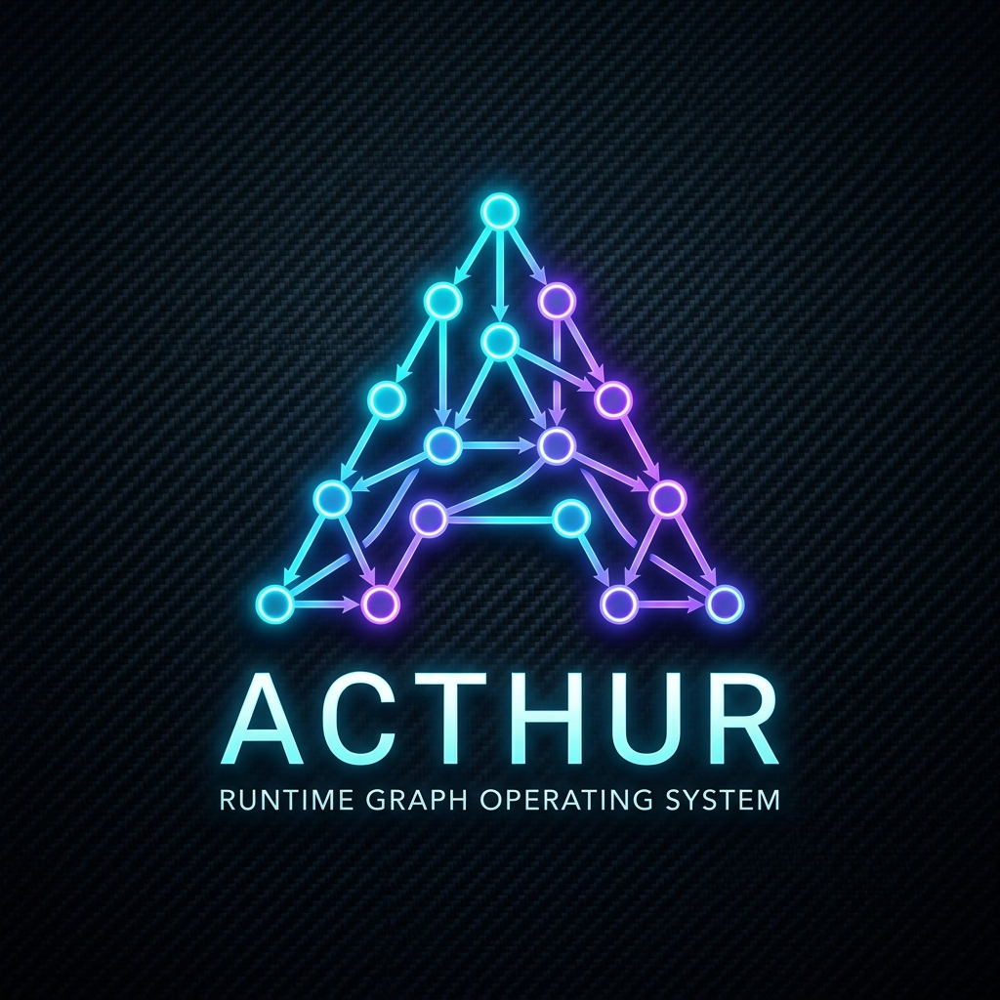
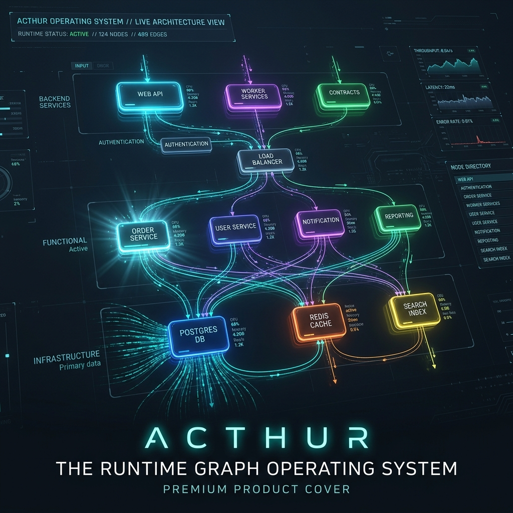
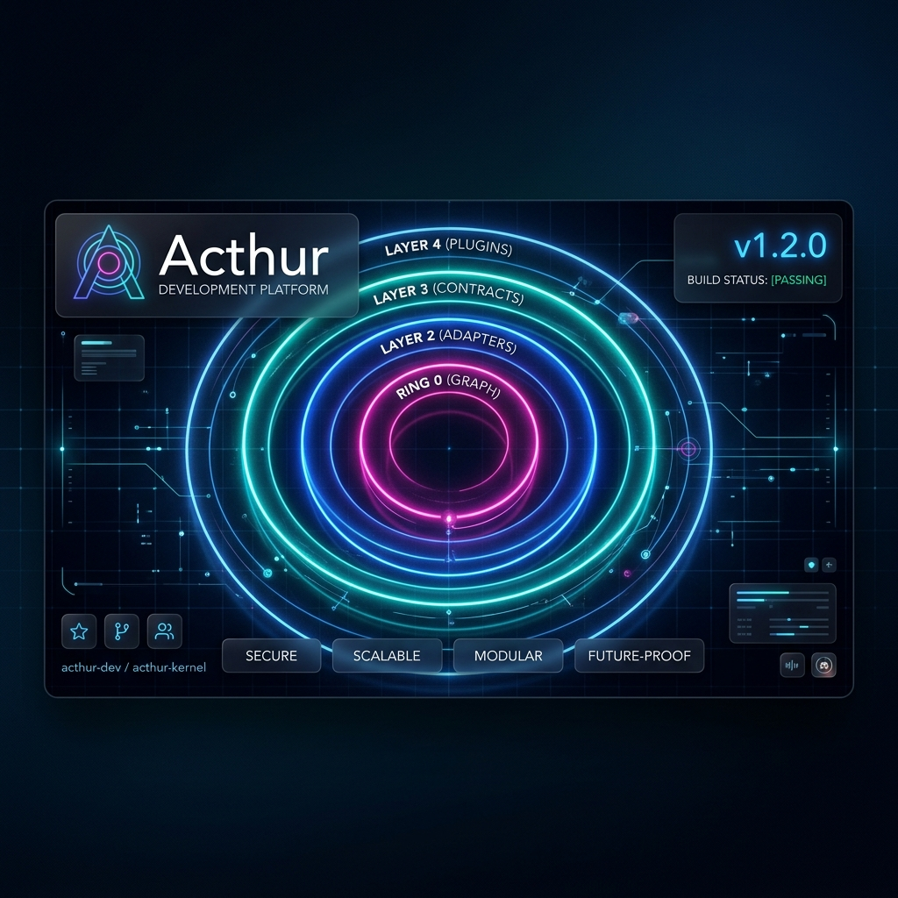
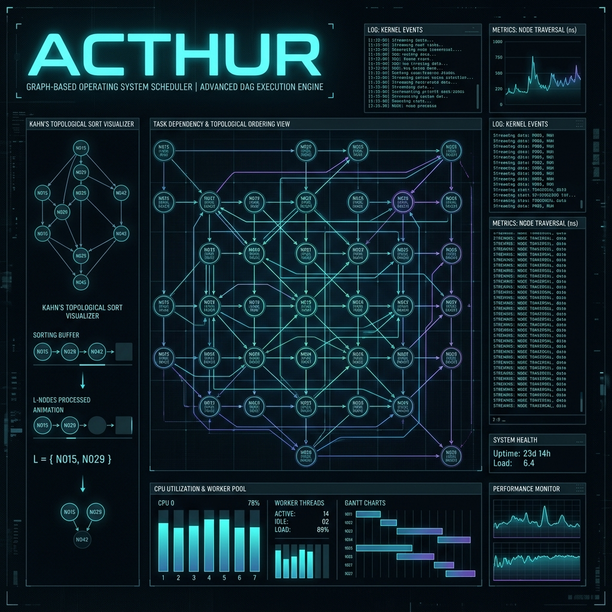
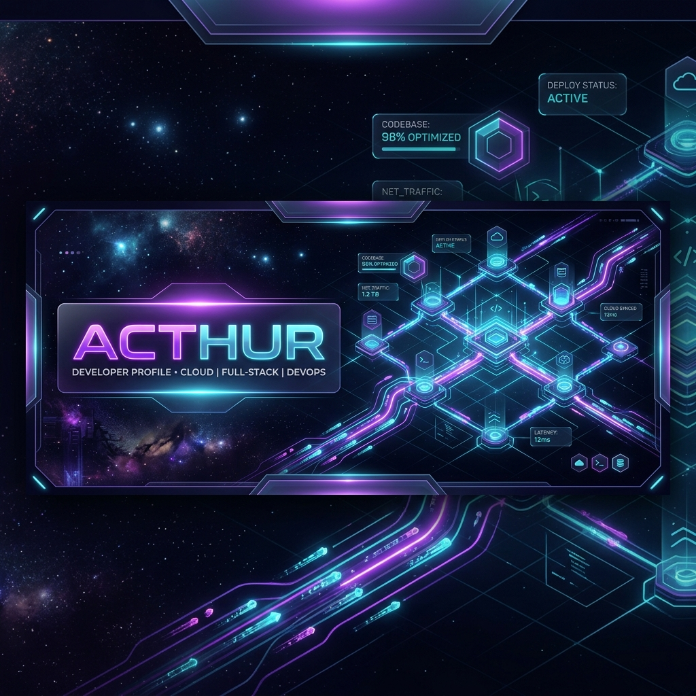
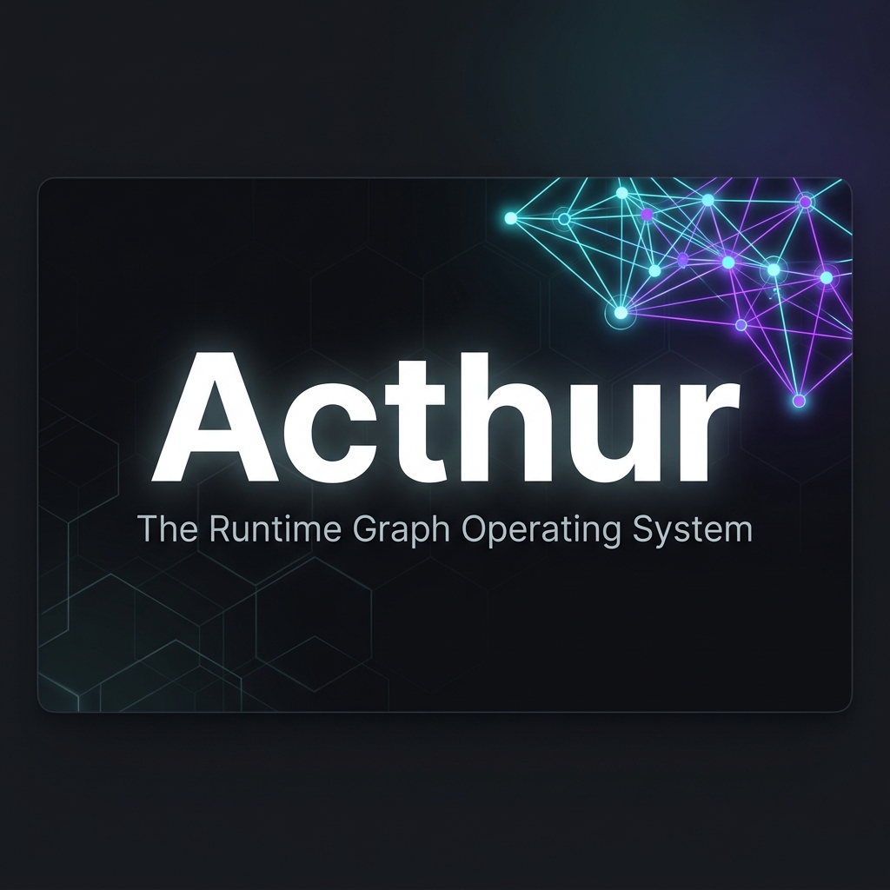
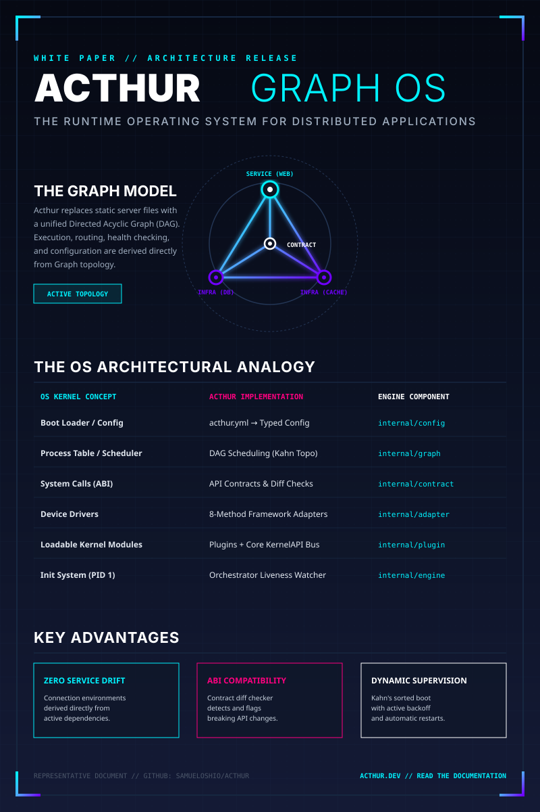
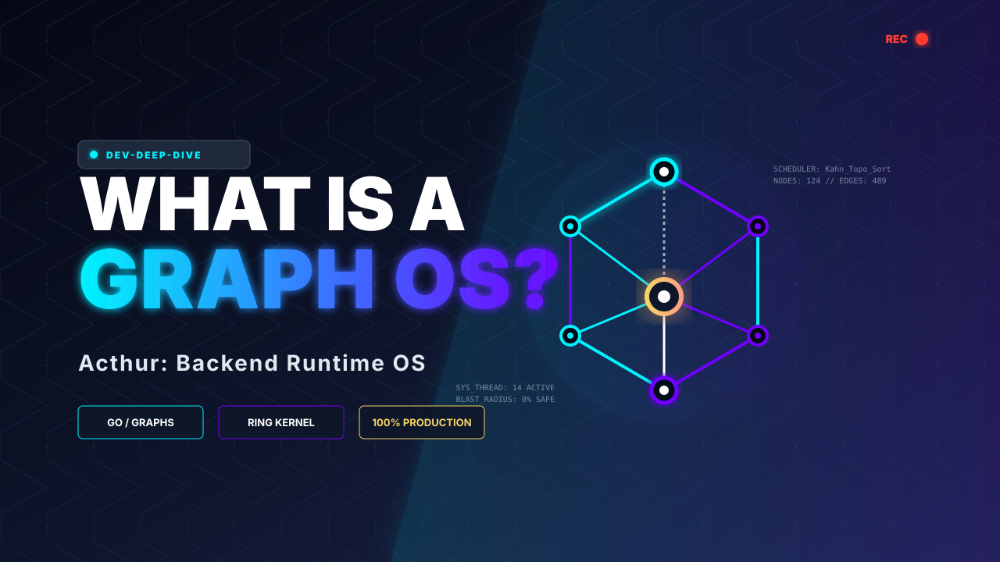
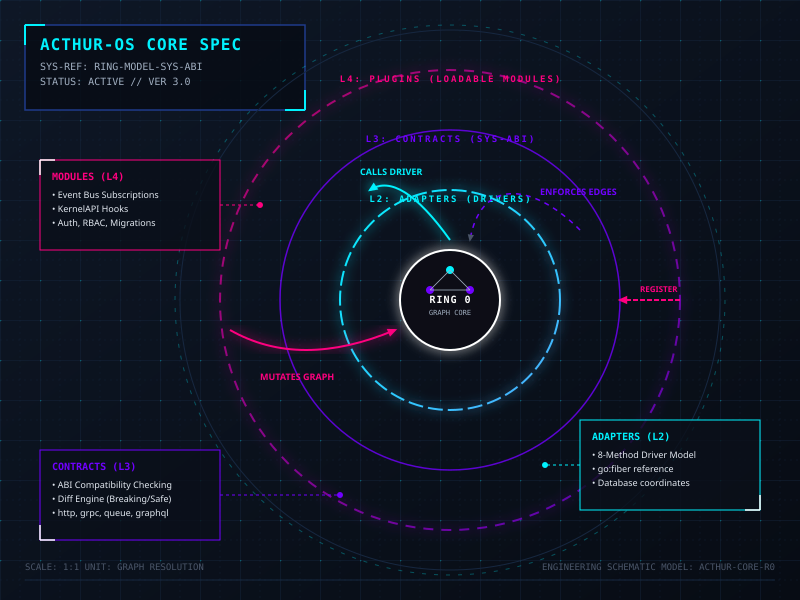
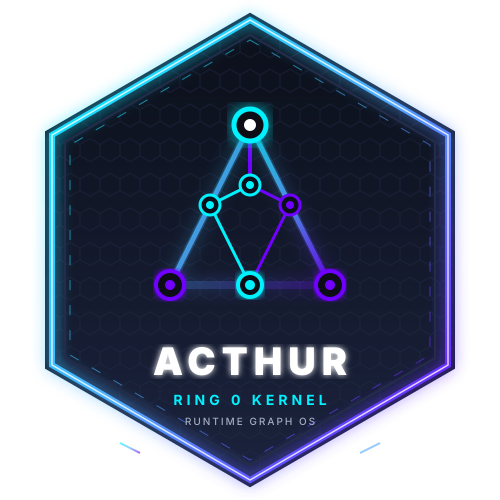

# Acthur Premium Marketing Assets Showcase

This directory contains a suite of 10 premium, high-fidelity marketing assets designed for **Acthur — The Runtime Graph Operating System**. 

The design visual language is built around cybernetic node-link Directed Acyclic Graphs (DAGs), sleek dark modes, glowing connections, and clear technical typography. The assets are split into high-resolution PNGs and infinitely scalable vector SVGs.

---

## Portfolio Showcase

### 1. Brand Logo
* **Filename**: `brand_logo.png`
* **Format**: High-resolution PNG
* **Description**: Abstract geometric letter "A" composed of interconnected, glowing cybernetic network nodes in a Directed Acyclic Graph (DAG) with a clean dark carbon-fiber pattern background.
* **Best Used For**: Brand identity, profile pictures, GitHub repository icons.

---

### 2. Product Cover
* **Filename**: `product_cover.png`
* **Format**: High-resolution PNG
* **Description**: A horizontal 16:9 cinematic shot illustrating an application's architecture running in a live graph, with backend services, database infrastructure, and API contracts shown as glowing 3D holographic components.
* **Best Used For**: GitHub repository headers, website landing page covers, product pitch slide background.

---

### 3. Page Cover
* **Filename**: `page_cover.png`
* **Format**: High-resolution PNG
* **Description**: Sleek header design featuring four glowing concentric rings representing Acthur's kernel protection layers (Ring 0: Graph, Layer 2: Adapters, Layer 3: Contracts, Layer 4: Plugins) over a glassmorphic dashboard interface.
* **Best Used For**: Documentation page headers, technical blog headings, readmes.

---

### 4. Wall Cover (Desktop Wallpaper)
* **Filename**: `wall_cover.png`
* **Format**: High-resolution PNG
* **Description**: 16:9 desktop wallpaper depicting a glowing blueprint of Acthur's advanced DAG scheduler, showing topological ordering views, Kahn's sort visualizer flow, system health checks, and thread monitors.
* **Best Used For**: Developer wallpapers, conference booth displays.

---

### 5. Social Cover
* **Filename**: `social_cover.png`
* **Format**: High-resolution PNG
* **Description**: Standard horizontal social banner containing abstract flows of cyan and violet data packets along graph connections, with glassmorphic stats overlays.
* **Best Used For**: Twitter/X headers, LinkedIn personal or company page banners.

---

### 6. Social Thumbnail (OpenGraph Card)
* **Filename**: `social_thumbnail.png`
* **Format**: High-resolution PNG
* **Description**: Clean OpenGraph sharing card featuring bold typography ("Acthur: The Runtime Graph Operating System") on a dark hexagonal grid card with a glowing graph accent.
* **Best Used For**: OpenGraph links shared on Discord, Twitter/X, Slack, or LinkedIn.

---

### 7. Marketing Flyer Infographic
* **Filename**: `marketing_flyer.svg`
* **Format**: Vector SVG (Scalable)
* **Description**: Detailed vertical poster comparing traditional operating system concepts with Acthur's corresponding runtime graph OS layers (e.g. Boot configs, topological schedulers, ABI contracts, drivers, modules).
* **Best Used For**: Print flyers, digital newsletter attachments, dev community posts.

---

### 8. Video Thumbnail
* **Filename**: `video_thumbnail.svg`
* **Format**: Vector SVG (Scalable)
* **Description**: High-impact, click-worthy 16:9 video thumbnail layout with giant glowing title text ("WHAT IS A GRAPH OS?") and an isometric glowing 3D graph block representation.
* **Best Used For**: YouTube video covers, conference talk slides, intro presentations.

---

### 9. Architecture Blueprint
* **Filename**: `architecture_blueprint.svg`
* **Format**: Vector SVG (Scalable)
* **Description**: High-precision engineering schematic illustrating Acthur's concentric security ring structure and packet-flow rules (e.g., Ring 0 calls Layer 2, Layer 4 mutates Ring 0).
* **Best Used For**: Core documentation pages, architecture diagrams, technical deep dives.

---

### 10. Laptop Sticker
* **Filename**: `laptop_sticker.svg`
* **Format**: Vector SVG (Scalable)
* **Description**: A premium hexagonal sticker badge showing the glowing core graph "A" logo and "Ring 0 Kernel" subtitle.
* **Best Used For**: Physical print laptop stickers, contributor swag, repo badges.

